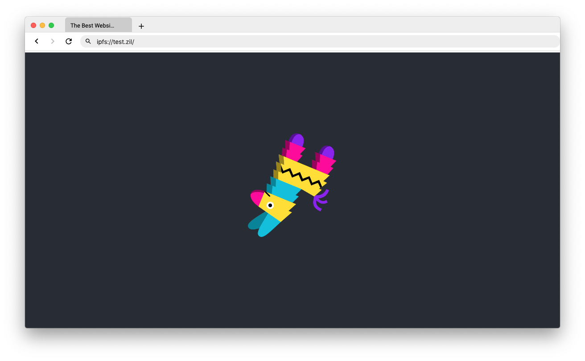

<p align="center">
  <a href="https://unstoppabledomains.com"></a>
</p>


<div align="center">
  <h1>Unstoppable Browser</h1>

  <p>
  The Unstoppable Browser is a web browser that can browse the decentralized web. Use it
  to visit .zil websites.
  </p>
</div>

# Motivation

[Unstoppable Domains](https://unstoppabledomains.com) is building a new DNS system. Unlike traditional DNS systems Unstoppable DNS data is stored on the Zilliqa blockchain. As a result, Zil domain lookups are impossible to block and names cannot be siezed.

By combining Zil domains with websites hosted on the peer-to-peer IPFS filesystem you can build and deploy your own uncensorable website. 

There's still a lot of work to do to make this vision a relaity but you can use the Unstoppable Browser to experience the uncensorable web today.

# Screenshots



# How we resolve domain names

## API

Unstoppable provides an API for doing zil domain name lookups. By default the Unstoppable Demo Browser queries this API to figure out what an address maps to. We do this because a direct blockchain lookup is a bit slow. This method puts trust in the validity of the Unstoppable API. If you want a more trustless approach you can resolve domain names using other methods.

## Via the Zilliqa blockchain API

The Zilliqua blockchain API provides access to the Zilliqa blockchain without you needing to host (and maintain) a copy of the blockchain yourself. This method puts trust in the validity of the Zilliqa API. If you want a more trustless approach you can resolve domain names using other methods.

## Directly off the blockchain

If you are running a local copy of the Zilliqa blockchain or you have a particular node you trust this method will read domain data directly off of the blockchain. This method is fairly trustless.

# How we load IPFS websites

The [IPFS](https://ipfs.io/) stores files by hash on a distributed peer-to-peer network. IPFS files can be referenced by a unique hash --> QmUD69diRF8jwju2k4b9mD7PaXMjtMAKafqascL18VKvoD --> try remembering that.

You can use this unique hash to retrieve files off the IPFS network. These files can be images, web pages, pdfs, anything. The Unstoppable Browser supports loading static html websites off of the IPFS network.

We support 2 main methods of loading IPFS sites. CDN-based loads and direct loads.

## Via CDNs

CDNs are networks of servers managed by companies like [Cloudflare](https://www.cloudflare.com) and [Infura](https://infura.io/) that cache and mirror content to help improve load times and distribute request load.

Both of these companies provide services that cache content from the IPFS network and serve it over standard HTTP connections.

The advantage of this approach is that pages load fast.

By default the Unstoppable Browser retrieves content from CDNs. If you are concerned with censorship or are interested in IPFS web browsing experience you can load load data directly off of IPFS.

## Directly off the IPFS filesystem

We can also load data directly off of IPFS. If you use this approach you should expect slower performance since files on IPFS are fetched differently from files stored on standard servers.

# Running the code for this project

## Project overview

The Unstoppable Browser is based on [Electron](https://electronjs.org/). Websites are rendered using Chromium (the same engine that powers Google Chrome) while the browser UI and control logic is implemented in JavaScript.

The project also uses [Typescript](https://www.typescriptlang.org/), [React](https://reactjs.org/), [Styled Components](https://www.styled-components.com/) and [Mobx](https://mobx.js.org/README.html). Project files are compiled with [Webpack](https://webpack.js.org/).

Electron applications are usually built in two pieces. There is a main application (src/electron/index.ts) --> this code opens a blank chrome window and loads html into that window. Then there is the html content that defines the UI and application flow (src/browserui/views/browser/index.tsx).

When you want to develop for this project you will need to run a process to generate the HTML alongside a process for the browser window.

## Setup

If you haven't already...
* [Install git (for downloading code from this repo)](https://gist.github.com/derhuerst/1b15ff4652a867391f03#file-mac-md)
* [Install npm (required to build this project)](https://www.npmjs.com/get-npm)
* [Install VSCode (an ide for working with typescript - recommended)](https://code.visualstudio.com/)

Clone this repo to your local computer -->

```
git clone https://github.com/unstoppabledomains/unstoppable-demo-browser
cd unstoppable-demo-browser

# Use npm to install project dependencies

npm install

# Dependencies will be installed into the node_modules folder
# Globally install the following dependencies

npm install --global webpack
npm install --global webpack-dev-server
npm install --global cross-env

```

Open the unstoppable-demo-browser folder in VSCode. You're good to go.

## Running the project

Running this project involves starting 2 separate processes. 
* The renderer process (npm run dev) generates html that describes the browser UI and handles user clicks and actions.
* The main process (npm run start) launches a blank browser window and loads content from the renderer into it.

To launch the browser -->

```
# Open two terminals. Make sure you're in the unstoppable-demo-browser folder in both terminals
# If you're not in the unstoppable-demo-browser folder you can use the 'cd' command to get there 

# Start the renderer process in the first terminal
npm run dev

# Wait for the renderer process to boot up --> 
# this needs process needs to boot first so that there is HTML content to load into the main process browser window

# Start the main process in the second terminal
npm run start

# A browser window should show up
# If all you see is a blank window check to make sure that the renderer process booted up successfully
```


## Building a release

The source for the unstoppable browser is written in Typescript and React. These languages get compiled into vanilla JavaScript by Webpack.
The output for the compile process are js and html files that are located in the build sub-folder.

```
# You can trigger a build operation by running -->

npm run build

# Check the build sub-folder and notice app.html and app.bundle.js files. 
# These files are the html content that gets loaded into the main process browser window.
```

To build a release -->

```
# For mac
npm run compile-darwin

# You will find the output of this operation in the dist folder
```

# Contributing

If you have found any bugs or questions feel free to open an issue. If you are interested in working with [Unstoppable Domains](https://unstoppabledomains.com/) please get in touch via the Unstoppable Domains website.

# Useful resources

If you're new to the JavaScript ecosystem and want to understand typescript [I found this guide to be helpful](https://medium.com/free-code-camp/how-to-set-up-a-typescript-project-67b427114884#51cb).